```mermaid
graph TB
    %% Frontend Layer
    subgraph FRONTEND["🖥️ Frontend Layer - React/Vite"]
        Browser["🌐 Web Browser<br/>http://localhost:5173"]
        App["App.jsx<br/>(Auth + Routing)"]
        
        subgraph Pages["📄 Pages"]
            Dashboard["DashboardPage<br/>(Video Library)"]
            Upload["UploadPage<br/>(Drag & Drop)"]
            Watch["WatchPage<br/>(Video Player)"]
        end
        
        subgraph Components["🎨 11 React Components"]
            Social["Social Components<br/>- CommentSection<br/>- VideoRatings<br/>- LikeButton<br/>- FollowButton"]
            Analytics["Analytics Components<br/>- EngagementTracker<br/>- VideoAnalyticsDashboard"]
            Admin["Admin Components<br/>- ViolationReportDialog<br/>- AdminDashboard"]
            Advanced["Advanced Components<br/>- RecommendationsPanel<br/>- HeatmapViewer<br/>- NotificationCenter"]
        end
    end
    
    %% Authentication Layer
    subgraph AUTH["🔐 Authentication Layer"]
        Cognito["AWS Cognito<br/>User Pool<br/>(video-platform-auth)"]
        Google["🔵 Google OAuth<br/>1057462478175-rav2v23m0t28fpljha96ts1svrlvl11p"]
        JWT["JWT Token<br/>Generation & Validation"]
    end
    
    %% API Gateway Layer
    subgraph APIGW["🚪 API Gateway"]
        HTTPApi["HTTP API<br/>execute-api<br/>ap-south-1"]
        JWTAuth["JWT Authorizer<br/>(Lambda)"]
        
        subgraph Routes["📍 26 API Routes"]
            Social_Routes["SOCIAL ENDPOINTS<br/>POST /videos/{id}/comments<br/>GET /videos/{id}/comments<br/>POST /videos/{id}/like<br/>DELETE /videos/{id}/like<br/>POST /videos/{id}/rate<br/>POST /users/{id}/follow<br/>DELETE /users/{id}/follow"]
            
            Analytics_Routes["ANALYTICS ENDPOINTS<br/>POST /videos/{id}/watch-session<br/>POST /videos/{id}/engagement<br/>GET /videos/{id}/analytics"]
            
            Admin_Routes["ADMIN ENDPOINTS<br/>POST /videos/{id}/report-violation<br/>GET /admin/audit-logs"]
            
            Advanced_Routes["ADVANCED ENDPOINTS<br/>GET /videos/{id}/recommendations<br/>POST /notifications/send<br/>GET /videos/{id}/heatmap"]
            
            Legacy_Routes["LEGACY ENDPOINTS<br/>POST /upload-url<br/>GET /video/{id}<br/>GET /stream/{id}<br/>GET /status/{id}<br/>GET /videos<br/>DELETE /video/{id}"]
        end
    end
    
    %% Lambda Functions Layer
    subgraph LAMBDA["⚡ Lambda Functions (14 Total)"]
        subgraph SocialLambdas["SOCIAL (5 Functions)"]
            CreateComment["create-comment<br/>Timeout: 30s<br/>Memory: 256MB"]
            GetComments["get-comments<br/>Timeout: 30s<br/>Memory: 256MB"]
            LikeVideo["like-video<br/>Timeout: 10s<br/>Memory: 256MB"]
            RateVideo["rate-video<br/>Timeout: 10s<br/>Memory: 256MB"]
            FollowUser["follow-user<br/>Timeout: 10s<br/>Memory: 256MB"]
        end
        
        subgraph AnalyticsLambdas["ANALYTICS (3 Functions)"]
            TrackSession["track-watch-session<br/>Timeout: 10s<br/>Memory: 256MB"]
            TrackEngagement["track-engagement<br/>Timeout: 10s<br/>Memory: 256MB"]
            GetAnalytics["get-video-analytics<br/>Timeout: 30s<br/>Memory: 512MB"]
        end
        
        subgraph AdminLambdas["ADMIN (2 Functions)"]
            ViolationReport["create-violation-report<br/>Timeout: 10s<br/>Memory: 256MB"]
            GetAuditLogs["get-audit-logs<br/>Timeout: 30s<br/>Memory: 512MB"]
        end
        
        subgraph AdvancedLambdas["ADVANCED (3 Functions)"]
            GetRecommend["get-recommendations<br/>Timeout: 30s<br/>Memory: 512MB"]
            SendNotif["send-notification<br/>Timeout: 10s<br/>Memory: 256MB"]
            GenHeatmap["generate-heatmap<br/>Timeout: 30s<br/>Memory: 512MB"]
        end
        
        subgraph LegacyLambdas["LEGACY & CORE (7 Functions)"]
            UploadUrl["upload-url"]
            GetVideo["get-video"]
            GetStream["get-stream"]
            GetStatus["get-status"]
            ListVideos["list-videos"]
            DeleteVideo["delete-video"]
            JwtAuth_Fn["jwt-authorizer"]
        end
    end
    
    %% Database Layer
    subgraph DATABASE["🗄️ Data Layer"]
        DynamoDB["AWS DynamoDB<br/>Single Table Design<br/>VideoTable"]
        
        subgraph DBSchema["📊 Table Schema"]
            PKSchema["Primary Key: PK, SK<br/>Partition & Sort Keys"]
            GSI1["Global Secondary Index 1<br/>GSI1PK, GSI1SK<br/>For user-based queries"]
            GSI2["Global Secondary Index 2<br/>GSI2PK, GSI2SK<br/>For engagement queries"]
        end
        
        subgraph Entities["📝 Data Entities"]
            VideoEntity["VIDEO#videoId<br/>Video metadata"]
            CommentEntity["COMMENT#videoId → timestamp<br/>Comments with TTL: 1 year"]
            LikeEntity["LIKE#videoId → userId<br/>Likes with TTL: 5 years"]
            RatingEntity["RATING#videoId → userId<br/>Ratings with TTL: 5 years"]
            FollowEntity["FOLLOW#targetId → userId<br/>User relationships"]
            WatchEntity["WATCH#videoId → sessionId<br/>Watch sessions with TTL"]
            EngageEntity["ENGAGEMENT#videoId → timestamp<br/>Engagement events with TTL"]
            AuditEntity["AUDIT#date → timestamp<br/>Audit logs with TTL: 1 year"]
            HeatmapEntity["HEATMAP#videoId → timestamp<br/>Heatmaps with TTL: 1 year"]
            NotifEntity["USER#userId → NOTIFICATION#id<br/>Notifications with TTL: 30 days"]
        end
    end
    
    %% Storage Layer
    subgraph STORAGE["💾 Storage Layer"]
        S3Raw["S3 Bucket: Raw Videos<br/>Uploaded content"]
        S3Processed["S3 Bucket: Processed Videos<br/>Transcoded HLS streams"]
        S3Thumbnails["S3 Bucket: Thumbnails<br/>Video preview images"]
        S3Subtitles["S3 Bucket: Subtitles<br/>SRT/VTT files"]
    end
    
    %% Video Processing Layer
    subgraph PROCESSING["🎬 Video Processing Layer"]
        EventBridge["AWS EventBridge<br/>Event Bus<br/>video-platform"]
        
        subgraph ProcessPipeline["Processing Functions"]
            FFmpeg["start-ffmpeg-job<br/>FFmpeg Lambda"]
            MediaConvert["start-transcode<br/>MediaConvert"]
            PostConfirm["post-confirmation<br/>User signup"]
            HandleFailure["handle-failure<br/>Error recovery"]
            Notification["notification<br/>Event notifications"]
        end
        
        subgraph PostProcessing["Post-Processing"]
            GenerateThumbnail["generate-thumbnail<br/>FFmpeg thumbnail"]
            GenerateMetadata["generate-metadata<br/>Extract video info"]
            GenerateClips["generate-clips<br/>AI clip generation"]
            ExtractFrames["extract-frames<br/>Frame extraction"]
            PlaylistAssemble["playlist-assembler<br/>HLS playlist creation"]
        end
        
        subgraph Callbacks["Callbacks"]
            MediaConvertCB["mediaconvert-callback<br/>Handle transcode complete"]
            PollTranscode["poll-transcode<br/>Check transcode status"]
            PollTranscript["poll-transcription<br/>Check subtitle status"]
        end
    end
    
    %% AI Layer
    subgraph AI["🤖 AI Features"]
        AISupervisor["ai-supervisor<br/>Orchestrate AI tasks"]
        BedRock["AWS Bedrock<br/>amazon.nova-lite-v1"]
        
        subgraph AIAgents["AI Agents"]
            ClipsAgent["clipsAgent<br/>Generate highlights"]
            MetadataAgent["metadataAgent<br/>Extract metadata"]
            ThumbnailAgent["thumbnailAgent<br/>Select best frame"]
        end
    end
    
    %% Delivery Layer
    subgraph DELIVERY["📡 Delivery Layer"]
        CloudFront["AWS CloudFront<br/>CDN Distribution<br/>Video streaming"]
        Signer["CloudFront Signer<br/>Signed URLs"]
        HLS["HLS.js Player<br/>Video playback"]
    end
    
    %% Monitoring Layer
    subgraph MONITORING["📊 Monitoring & Logging"]
        CloudWatch["AWS CloudWatch<br/>Logs & Metrics"]
        XRay["AWS X-Ray<br/>Request tracing"]
        Alarms["CloudWatch Alarms<br/>Error detection"]
        Logger["Shared Logger<br/>Structured JSON logging"]
    end
    
    %% Deletion Management
    subgraph DELETION["🗑️ Deletion Management"]
        MarkDeleting["mark-deleting<br/>Mark for deletion"]
        DeleteVideo_Fn["delete-video<br/>Remove video"]
        DeleteRaw["delete-raw-video<br/>Clean raw file"]
        DeleteS3["delete-s3-prefix<br/>Clean S3"]
        MarkFailed["mark-delete-failed<br/>Handle errors"]
        StateMachine["Deletion State Machine<br/>Orchestrate cleanup"]
    end
    
    %% Shared Services
    subgraph SHARED["🔧 Shared Services"]
        DynamoService["dynamoService.js<br/>DynamoDB queries"]
        CircuitBreaker["circuitBreaker.js<br/>Fault tolerance"]
        HTTPClient["http.js<br/>HTTP requests"]
        SecretsMgr["secrets.js<br/>AWS Secrets Manager"]
        CloudFrontSign["cloudfront-signer.js<br/>URL signing"]
        EventParser["eventParser.js<br/>Event parsing"]
        EventPub["eventPublisher.js<br/>Event publishing"]
        ProcessingPlan["processingPlan.js<br/>Pipeline orchestration"]
    end
    
    %% Connections - Frontend to Auth
    Browser --> App
    App --> Pages
    App --> Components
    Pages --> Components
    
    Components --> HTTPApi
    
    %% Frontend to Auth
    App --> Cognito
    Cognito --> Google
    Cognito --> JWT
    JWT --> JWTAuth
    
    %% Auth to API Gateway
    JWTAuth --> HTTPApi
    
    %% API Routes to Lambda
    Social_Routes --> SocialLambdas
    Analytics_Routes --> AnalyticsLambdas
    Admin_Routes --> AdminLambdas
    Advanced_Routes --> AdvancedLambdas
    Legacy_Routes --> LegacyLambdas
    
    %% Lambda to Database
    SocialLambdas --> DynamoDB
    AnalyticsLambdas --> DynamoDB
    AdminLambdas --> DynamoDB
    AdvancedLambdas --> DynamoDB
    LegacyLambdas --> DynamoDB
    
    DynamoDB --> DBSchema
    DBSchema --> Entities
    
    %% Lambda to Storage
    LegacyLambdas --> S3Raw
    ProcessPipeline --> S3Processed
    ProcessPipeline --> S3Thumbnails
    ProcessPipeline --> S3Subtitles
    
    %% Lambda to Shared Services
    SocialLambdas --> DynamoService
    AnalyticsLambdas --> DynamoService
    AdminLambdas --> DynamoService
    AdvancedLambdas --> DynamoService
    LegacyLambdas --> DynamoService
    
    SocialLambdas --> Logger
    AnalyticsLambdas --> Logger
    AdminLambdas --> Logger
    AdvancedLambdas --> Logger
    
    ProcessPipeline --> CircuitBreaker
    ProcessPipeline --> HTTPClient
    ProcessPipeline --> SecretsMgr
    
    %% Video Processing
    UploadUrl --> EventBridge
    EventBridge --> ProcessPipeline
    ProcessPipeline --> MediaConvert
    ProcessPipeline --> FFmpeg
    ProcessPipeline --> PostProcessing
    ProcessPipeline --> Callbacks
    
    %% AI Processing
    ProcessPipeline --> AISupervisor
    AISupervisor --> BedRock
    BedRock --> AIAgents
    AIAgents --> PostProcessing
    
    %% Delivery
    S3Processed --> CloudFront
    S3Thumbnails --> CloudFront
    CloudFront --> Signer
    Signer --> HLS
    HLS --> Browser
    
    %% Deletion
    DeleteVideo --> StateMachine
    StateMachine --> MarkDeleting
    StateMachine --> DeleteRaw
    StateMachine --> DeleteS3
    MarkFailed --> StateMachine
    
    %% Monitoring
    SocialLambdas --> CloudWatch
    AnalyticsLambdas --> CloudWatch
    AdminLambdas --> CloudWatch
    AdvancedLambdas --> CloudWatch
    LegacyLambdas --> CloudWatch
    ProcessPipeline --> CloudWatch
    
    HTTPApi --> XRay
    CloudWatch --> Alarms
    
    %% Event Publishing
    EventPub --> EventBridge
    ProcessPipeline --> EventPub
    
    style FRONTEND fill:#e1f5ff
    style AUTH fill:#f3e5f5
    style APIGW fill:#fff3e0
    style LAMBDA fill:#e8f5e9
    style DATABASE fill:#fce4ec
    style STORAGE fill:#f1f8e9
    style PROCESSING fill:#e0f2f1
    style AI fill:#fff9c4
    style DELIVERY fill:#ede7f6
    style MONITORING fill:#f0f4c3
    style DELETION fill:#ffebee
    style SHARED fill:#ede7f6
```

---

## 🏗️ SYSTEM ARCHITECTURE DIAGRAM EXPLAINED

### Layer Breakdown:

#### 1️⃣ **Frontend Layer** (Client-Side - React)
- **Single Page Application**: Vite + React 18
- **11 Components**: Reusable UI components for all features
- **3 Pages**: Dashboard, Upload, Watch
- **Flows**: User interactions → API calls

#### 2️⃣ **Authentication Layer**
- **AWS Cognito**: User pool management
- **Google OAuth**: 3rd-party authentication
- **JWT**: Stateless token-based authorization
- **JWT Authorizer**: Lambda validates tokens on every API call

#### 3️⃣ **API Gateway Layer** (HTTP API)
- **26 Routes**: Organized by feature (social, analytics, admin, advanced, legacy)
- **JWT Validation**: Every request must have valid token
- **CORS**: Enabled for localhost and Cognito domain
- **Rate Limiting Ready**: Can add WAF rules

#### 4️⃣ **Lambda Functions Layer** (14 Functions)

**Social (5 functions)**
- Comments, Likes, Ratings, Following system
- Audit logging for compliance

**Analytics (3 functions)**
- Watch session tracking
- Engagement event capture
- Video metrics aggregation (4 DynamoDB queries)

**Admin (2 functions)**
- Violation reporting system
- Audit log queries with admin-only access

**Advanced (3 functions)**
- Recommendations (collaborative filtering)
- Notifications (SNS + stored)
- Heatmaps (viewer drop-off tracking)

**Legacy & Core (7 functions)**
- Video upload, streaming, status
- JWT authorization
- Video listing, deletion

#### 5️⃣ **Database Layer** (DynamoDB - Single Table)
- **Primary Key**: PK + SK (partition + sort)
- **GSI1**: User-based queries
- **GSI2**: Engagement-based queries
- **Auto-Scaling**: On-demand billing
- **Encryption**: AWS managed keys
- **TTL**: Auto-cleanup policies

**Data Entities**:
- Videos, Comments, Likes, Ratings
- Follows, Watch sessions, Engagement
- Audit logs, Heatmaps, Notifications

#### 6️⃣ **Storage Layer** (S3 Buckets)
- **Raw Videos**: Original uploads
- **Processed Videos**: HLS streams (HTTP Live Streaming)
- **Thumbnails**: Video preview images
- **Subtitles**: SRT/VTT subtitle files

#### 7️⃣ **Video Processing Layer**
- **EventBridge**: Event-driven architecture
- **FFmpeg Lambda**: Video transcoding
- **MediaConvert**: AWS video service
- **Post-Processing**: Thumbnails, metadata, clips
- **Callbacks**: Handle async completion

#### 8️⃣ **AI Features Layer** (AWS Bedrock)
- **Supervisor Agent**: Orchestrate AI tasks
- **AI Agents**: 
  - Clips Agent: Highlight generation
  - Metadata Agent: Extract description
  - Thumbnail Agent: Best frame selection

#### 9️⃣ **Delivery Layer** (CDN)
- **CloudFront**: Global content delivery
- **Signed URLs**: Secure streaming
- **HLS.js Player**: Client-side video playback

#### 🔟 **Monitoring & Logging**
- **CloudWatch Logs**: Structured JSON logging
- **X-Ray Tracing**: Request performance
- **CloudWatch Alarms**: Error detection
- **Metrics**: Lambda, DynamoDB, API monitoring

#### 1️⃣1️⃣ **Deletion Management**
- **State Machine**: Orchestrate cleanup
- **Multi-step deletion**: Video, raw file, S3 cleanup
- **Error handling**: Mark failed for retry

#### 1️⃣2️⃣ **Shared Services**
- **DynamoDB Service**: Centralized DB operations
- **Circuit Breaker**: Fault tolerance
- **HTTP Client**: External API calls
- **Secrets Manager**: Credential management
- **Event Publisher**: Async communication
- **Processing Plan**: Pipeline orchestration

---

## 📊 DATA FLOWS

### Flow 1: User Posts Comment
```
Browser 
  → React Component 
  → HTTP API POST /videos/{id}/comments 
  → JWT Authorizer validates token
  → create-comment Lambda
  → DynamoDB write (COMMENT entity)
  → Auto-create AUDIT log entry
  → CloudWatch logging
  → Response 201 to browser
  → Component refresh
```

### Flow 2: Analytics Query
```
Browser 
  → VideoAnalyticsDashboard component
  → HTTP API GET /videos/{id}/analytics
  → JWT validation
  → get-video-analytics Lambda
  → 4 parallel DynamoDB queries:
     - Query WATCH entities (sessions)
     - Query ENGAGEMENT entities (events)
     - Query LIKE entities (count)
     - Query RATING entities (average)
  → Aggregate results
  → CloudWatch metrics
  → Response 200 JSON with metrics
```

### Flow 3: Video Upload & Processing
```
Browser 
  → UploadPage component
  → HTTP API POST /upload-url
  → Lambda generates presigned S3 URL
  → Browser uploads to S3 directly
  → S3 → EventBridge trigger
  → ProcessPipeline Lambda
  → EventBridge distributes to:
     - FFmpeg transcoding
     - Thumbnail generation
     - Metadata extraction
     - AI agents processing
  → Store in DynamoDB
  → Update S3 with processed files
  → CloudFront distributes
  → Notification sent to user
```

### Flow 4: Recommendation Generation
```
Browser 
  → GET /videos/{id}/recommendations
  → JWT validation
  → get-recommendations Lambda
  → Query DynamoDB GSI2 for users who watched
  → For each user, query their watch history
  → Calculate similarity scores
  → Return top 6 recommendations
  → Frontend renders cards
```

### Flow 5: Admin Audit Access
```
Browser 
  → AdminDashboard component
  → GET /admin/audit-logs?userId={id}
  → JWT validation
  → get-audit-logs Lambda
  → Check user permission (ADMIN role)
  → If not admin: Return 403
  → If admin: Query AUDIT entities
  → Return paginated logs
```

---

## 🔌 API INTEGRATION MATRIX

| Endpoint | Lambda | DynamoDB Access | Shared Services | Response |
|----------|--------|---|---|---|
| POST /videos/{id}/comments | create-comment | Write COMMENT | DynamoService, Logger | 201 |
| GET /videos/{id}/comments | get-comments | Read COMMENT | DynamoService | 200 |
| POST /videos/{id}/like | like-video | Write LIKE | DynamoService | 201/409 |
| DELETE /videos/{id}/like | like-video | Delete LIKE | DynamoService | 200 |
| POST /videos/{id}/rate | rate-video | Write RATING | DynamoService | 201 |
| POST /users/{id}/follow | follow-user | Write FOLLOW | DynamoService | 201/409 |
| DELETE /users/{id}/follow | follow-user | Delete FOLLOW | DynamoService | 200 |
| POST /videos/{id}/watch-session | track-watch-session | Write WATCH | DynamoService | 201 |
| POST /videos/{id}/engagement | track-engagement | Write ENGAGEMENT | DynamoService, Logger | 201 |
| GET /videos/{id}/analytics | get-video-analytics | Query 4 entities | DynamoService | 200 |
| POST /videos/{id}/report-violation | create-violation-report | Write VIOLATION | DynamoService, Logger | 201 |
| GET /admin/audit-logs | get-audit-logs | Query AUDIT | DynamoService, Security | 200/403 |
| GET /videos/{id}/recommendations | get-recommendations | Query GSI2 | DynamoService | 200 |
| POST /notifications/send | send-notification | Write NOTIFICATION | DynamoService, SNS | 201 |
| GET /videos/{id}/heatmap | generate-heatmap | Query ENGAGEMENT | DynamoService | 200 |

---

## 🔐 SECURITY ARCHITECTURE

```
┌─────────────────────────────────────────┐
│ User Browser                             │
└────────────┬────────────────────────────┘
             │ HTTPS
┌────────────▼────────────────────────────┐
│ API Gateway (HTTPS only)                │
│ - CORS validation                       │
│ - Request size limits                   │
└────────────┬────────────────────────────┘
             │
┌────────────▼────────────────────────────┐
│ JWT Authorizer Lambda                   │
│ - Verify JWT signature                  │
│ - Check token expiration                │
│ - Validate claims                       │
└────────────┬────────────────────────────┘
             │
┌────────────▼────────────────────────────┐
│ Business Logic Lambda                   │
│ - Input validation                      │
│ - Authorization checks                  │
│ - Audit logging                         │
└────────────┬────────────────────────────┘
             │
┌────────────▼────────────────────────────┐
│ DynamoDB                                │
│ - Encryption at rest (KMS)              │
│ - Fine-grained IAM permissions          │
│ - VPC endpoints                         │
│ - Audit logging (CloudTrail)            │
└─────────────────────────────────────────┘
```

---

## 💰 RESOURCE UTILIZATION

| Resource | Estimated Load | Scaling Strategy |
|----------|---|---|
| Lambda Concurrent | 100 | Auto-scaling up to 1000 |
| DynamoDB RCU/WCU | On-demand | Pay per request |
| S3 Storage | 1TB+ | Unlimited scaling |
| CloudFront | Unlimited | Global distribution |
| API Calls/sec | 1000+ | API Gateway managed |

---

## 🎯 DEPLOYMENT TOPOLOGY

```
ap-south-1 (Mumbai Region)
├── API Gateway (HTTP API)
├── Lambda Functions (14)
├── DynamoDB Table (1)
├── S3 Buckets (4)
├── Cognito User Pool
├── CloudFront Distribution
├── EventBridge Bus
├── CloudWatch Logs
└── X-Ray Tracing
```

---

This diagram shows the complete end-to-end architecture with all 14 Lambda functions, 26 API routes, 11 React components, and all AWS services integrated!
